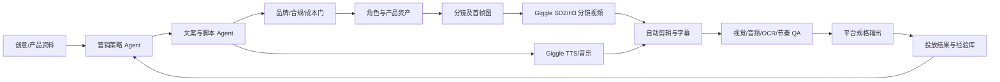

# AdForge：专业级广告营销视频生产线方案

**版本**：方案 v0.1（2026-09-14）  
**目标**：用户输入一个创意，自动得到可投放的广告文案、脚本、素材、成片及可审计的变体数据；视频与图片生成统一走 Giggle API，视频模型支持 Seedance 2.0 Pro（简称 SD2）和 MiniMax-H3。

## 1. 先给结论

这不是“把一句话交给视频模型”的脚本，而是一个小型广告制作部门：



专业工具的共性是“创意批量化 + 品牌约束 + 效果反馈”：Creatify 首页强调 URL-to-video、竞争创意分析、批量变体、A/B 测试和逐素材 ROAS/CTR；Arcads 强调 AI 演员、产品展示、工作流画布、编辑/翻译/字幕/重混和创意测试；HeyGen 强调角色一致性、口播、B-roll、字幕、品牌包和多语言；Synthesia 强调品牌包、模板、从想法/链接/文档到视频和规模化本地化；Creatomate 证明模板渲染 API 适合把动态数据批量注入成片。我们吸收其生产闭环，但保留 Giggle 作为媒体生成层。

投放创意采用平台已验证的基本骨架：TikTok 官方建议 9:16、至少 720p、避开 UI 安全区、用声音/音乐、前 3 秒提出命题、前 6 秒完成 Hook、突出 USP 并以明确 CTA 收束；字幕应提供上下文。不同平台会有自己的时长、码率、文字安全区和广告政策，因此“一个母版，多种平台交付”必须在后期完成，而不是让模型一次猜对。

## 2. 产品边界与三条生产路线

### A. 产品展示广告（默认路线）

适合电商、软件、餐饮和消费品。产品图/包装是权威资产；视频用首帧+产品参考图，先做 2–3 个 Hook 方向，再各出 3 个镜头变体。此路线不依赖真人数字人，最容易自动化和稳定验收。

### B. 剧情式广告（Task2-1 生产规则的广告化）

适合需要“问题—冲突—转折—解决”的品牌故事。超过 15 秒必须按角色卡、场景卡、分镜、首帧、分镜视频、后期拼接执行；每个 Giggle 镜头不超过模型上限，长片靠分段和后期装配。继承 Task2-1 的状态合同、资产 SHA 绑定、镜头级 QA、音画分离、失败记忆、付费事务和发布前门禁。

### C. 数字人口播广告（明确风险路线）

Giggle 负责图像/视频，Giggle TTS 负责旁白。必须把“数字人外观一致”与“口型同步”分成两个验收问题：H3/SD2 的 flat reference 不能自动宣称硬身份锁，口型需用成片音画检查；必要时产品采用“画外旁白 + 产品镜头”，避免把整条投放建立在不稳定的脸部口型上。真实人物/声音只能在取得授权、可审计的前提下使用。

## 3. 自动化用户流程

1. 用户输入创意、产品 URL/卖点/受众、目标平台、语言、画幅和时长；可上传产品图、Logo、品牌手册和参考广告。
2. **策略 Agent** 抽取受众痛点、单一核心卖点、证明方式、禁用承诺和 CTA，生成 3 个方向：Problem/Solution、Demo/Proof、Emotion/Story。每个方向写 Hook、USP、证据、CTA 和预期平台。
3. **文案 Agent** 输出标题、6 秒 Hook、15 秒版、30 秒版、旁白逐字稿、画面文字、镜头脚本、音效、负面提示和品牌词表；同一语言输入只输出该语言。
4. **用户确认门**：用户选择方向或修改卖点。自动模式可以批准默认最佳方向，但付费生成前必须保存版本、成本上限和引用素材清单。
5. **导演 Agent** 生成角色/产品/场景资产表和逐镜头合同；产品、Logo、配色、字体、价格、免责声明都有唯一 owner，不允许模型自由改写。
6. **资产 Agent** 通过 Giggle text-to-image/image-to-image 生成角色卡、产品 hero 图、关键首帧；关键资产保存 prompt SHA、输入 SHA、task_id、结果 URL 和审查结果。
7. **视频 Agent** 通过 Giggle text/image/omni-video 逐镜头生成；每镜同时记录分镜、首帧、参考图/视频的编号和 URL，生成失败根据错误类别改写变量，不得原 prompt 付费重试。
8. **后期 Agent** 用 FFmpeg/PyAV 完成拼接、音频混音、字幕、安全区、调色、Logo/CTA 尾卡、横竖方输出和缩略图。模板和 EDL 可重跑。
9. **审片 Agent** 抽帧 + OCR + 音频波形/响度 + 媒体探针，检查身份、产品、动作因果、文字、台词、口型、闪帧、黑帧、接缝、节奏和技术规格；失败只回退到有问题的镜头。
10. 输出母版、平台派生版本、脚本/分镜/字幕 JSON、QA JSON、成本账单和可下载链接；只在用户明确授权后接入投放平台。

## 4. Giggle 接入合同

统一客户端：`https://giggle.pro/api/v1`，统一读取系统环境变量 `GIGGLE_API_KEY`，不把 Key 写入日志或仓库。提交先写 durable transaction，再 POST；得到 task_id 后绑定事务，轮询 `/generation/task/query`，原始响应和精简回执分开保存。

| 能力 | Giggle 调用 | 当前生产约束 |
|---|---|---|
| 产品/角色图片 | `text-to-image`、`image-to-image` | 资产 URL/base64、宽高比、分辨率、结果 SHA；水印关闭须记录 |
| SD2 视频 | `text-to-video`、`image-to-video`、`omni-video` | `seedance-2.0-pro`；4–15 秒整数；图片最多 9 张；支持 16:9/9:16/1:1/3:4/4:3 |
| H3 视频 | 同上 | `MiniMax-H3`；3–15 秒整数；Giggle skill 记录 480p/768p；先做真实接口能力探测，不假定 H3 Ref2VA 语法被服务端原样保留 |
| 旁白 | Giggle TTS | 提交前选择 voice_id、情绪、语速；保存 signed URL 原文和音频 SHA |
| 音乐 | Giggle music | 无歌词时用 instrumental；音乐与旁白分轨，音量由后期合同控制 |

SD2 适合作为默认商业镜头模型；H3 作为动作、参考和口播实验分支。二者不能静默混用提示词方言。Giggle skill 的 `@图片N/@视频N/@音频N` 仅是输入编号习惯，生产线必须把每一编号映射到真实 URL，并验证数量和顺序。超过 15 秒必须拆镜，不能假设接口会生成可靠长片。

## 5. 质量、成本与安全门

### 生成前门

`strategy_pass`、`script_pass`、`brand_pass`、`asset_authority_pass`、`budget_pass`、`provider_contract_pass` 全部为 PASS 才能付费。每个任务持有 `project_id / version / shot_id / prompt_sha / input_sha / model / attempt`。

### 成片门

- **内容**：前 3 秒命题，前 6 秒 Hook；卖点可见且有证据，CTA 明确；无虚假比较、无法证实的功效、未授权人物/声音。
- **连续性**：产品包装、Logo、颜色、角色、手持关系、空间方向和数量在镜头间一致；参考图送达不等于身份锁，必须看结果。
- **文字**：OCR 检测乱码、错价、错品牌、伪中文、双层字幕；价格和免责声明必须来自 canonical 文档。
- **音画**：对白逐字核对，响度/削波/静音段检查；可见说话脸才检查口型，画外旁白不伪装成口型同步。
- **技术**：解码、帧率、时长、分辨率、黑帧/闪帧、字幕安全区、封装和平台规格检查。

### 失败与预算

Provider 失败（超时、5xx、额度、没有 task_id）先对账并暂停，不盲重提；健康生成失败才允许在预算内改写。图片最多 10 次、视频最多 3 次健康创意尝试；每次必须保存失败原因和 `do_not_repeat` 规则。任务恢复优先于新 POST；未确认“零扣费”不允许重提。预算账本按项目、镜头、模型、尝试记录 pay/refund/net。

## 6. 工程架构与可移植部署

```text
adforge/
  apps/api/                 # FastAPI：项目、版本、审批、任务、下载
  apps/worker/              # Celery/RQ：分镜生成、轮询、后期、QA
  packages/contracts/       # JSON Schema：project/shot/asset/transaction/qa
  packages/giggle/          # Giggle 客户端、重试、签名 URL、响应净化
  packages/director/        # 策略、文案、分镜、prompt compiler
  packages/post/            # FFmpeg、字幕、混音、平台派生
  packages/qa/              # ffprobe、OCR、抽帧、响度、规则门
  knowledge/                # 失败记忆、提示词词库、平台规格、经验卡
  templates/                # 广告结构、品牌包、CTA、字幕和 EDL
  infra/docker-compose.yml  # API/worker/Postgres/Redis/MinIO
  docs/                     # 部署、运维、数据处理与扩展指南
  tests/                    # 合同、离线模拟器、回归样本
```

默认组件：Python 3.11、FastAPI、PostgreSQL、Redis、S3 兼容对象存储（MinIO 或云桶）、FFmpeg、Docker Compose；可把队列换成云队列，把 Postgres/桶换成托管服务。所有配置由 `.env.example` 注入，数据库迁移和健康检查可重复执行。媒体只存私有桶，签名 URL 短时有效；仓库只放合成样例、schema、代码和经验库，不放 Key、真人资料、生产媒体、浏览器配置、task_id 账本和客户个人信息。

异地部署验收：一台干净机器 `docker compose up -d`；运行迁移、`/healthz`、Giggle dry-run、离线模拟生成、FFmpeg/QA smoke test；再由部署者自行设置 `GIGGLE_API_KEY` 做一枚低成本测试镜头。生产数据和密钥不随 GitHub 仓库迁移。

## 7. 经验库设计

每次成片把可复用知识写成结构化卡片：`失败类型、触发条件、原 prompt SHA、修改变量、有效 prompt SHA、模型/画幅/版本、证据路径、适用范围、置信度`。检索按题材、平台、模型、镜头类型和失败码过滤；把“模型效果猜测”与“已验证接口事实”分开。每次升级模型先跑固定回归集：产品一致性、文字、动作、对白、参考图运输和技术输出。

## 8. 分阶段实施与交付验收

**阶段 0：合同与样例**——冻结 schema、Giggle 适配器、品牌包、3 个广告样例、离线模拟器。验收是无 Key 可跑全链路预检，Key 不出日志。

**阶段 1：MVP**——创意→三方向文案→选定方向→图片/视频任务→FFmpeg→字幕→QA→下载；支持 9:16、16:9，SD2 主路线，H3 feature flag。

**阶段 2：专业化**——角色/产品身份门、事务账本、并行镜头、失败记忆、TTS/音乐分轨、平台派生、经验库和可重跑 EDL。

**阶段 3：规模化**——批量变体、Webhook/队列、团队审批、投放数据导入、Hook/CTA A/B 报表、云部署和 GitHub Release。

最终验收标准不是“能生成一条视频”，而是：同一输入可重跑；每个输出能追溯到文案、素材、模型、task_id、SHA、成本和 QA；删掉某一镜头后能局部重跑；换一台异地机器能部署；没有密钥和客户数据进入公开仓库。

## 9. 调研依据与当前限制

- [Creatify](https://creatify.ai/)：URL-to-video、创意 Agent、批量变体、A/B 与 ROAS/CTR 反馈。
- [Arcads](https://www.arcads.ai/)：AI 演员、产品展示、创意工作流、编辑/翻译/字幕/重混。
- [HeyGen](https://www.heygen.com/)：角色一致性、口播、B-roll、字幕、品牌包和多语言。
- [Synthesia](https://www.synthesia.io/)：品牌包、模板、链接/文档/想法到视频、规模化本地化。
- [Creatomate](https://creatomate.com/)：模板编辑器、Creation API、动态数据批量渲染。
- [TikTok Creative Best Practices](https://ads.tiktok.com/resources/help/article/creative-best-practices?lang=en)：9:16、720p、声音、安全区、前 3/6 秒、Hook/USP/CTA、字幕。
- [Giggle Seedance skill](https://github.com/giggle-official/skills/tree/main/skills/giggle-seedance2-gen) 与 [Giggle H3 skill](https://github.com/giggle-official/skills/tree/main/skills/giggle-minimax-h3-gen)：接口路径、模型名、时长、画幅、omni 素材约束和提示词规则。
- 本机 Task2-1/青山生产线：镜头级合同、资产 SHA、付费事务、失败记忆、并行生成、音画/OCR/最终发布门禁；其生产媒体和客户数据不应复制进公开仓库。

以上是实施基线。下一步可以按此方案创建 `adforge` 仓库：先生成公共代码、环境组件、schema、经验库和 Docker 部署骨架，再接入你的 Giggle Key 做第一条真实广告的端到端验收。
